# SOEN345-Ticket-Reservation

Repository for SOEN345 Ticket Reservation

```mermaid
classDiagram
    direction TB

    %% ── Enums ──
    class UserRole {
        <<enumeration>>
        CUSTOMER
        ADMIN
    }
    class EventCategory {
        <<enumeration>>
        MOVIE
        CONCERT
        TRAVEL
        SPORTS
    }
    class ReservationStatus {
        <<enumeration>>
        CONFIRMED
        CANCELLED
    }

    %% ── Entity Models ──
    class User {
        -Long id
        -String name
        -String email
        -String phone
        -String password
        -UserRole role
    }
    class Event {
        -Long id
        -String title
        -String description
        -LocalDateTime date
        -String location
        -EventCategory category
        -int capacity
        -BigDecimal price
        -Long version
    }
    class Reservation {
        -Long id
        -User user
        -Event event
        -ReservationStatus status
        -LocalDateTime reservedAt
        -String confirmationCode
    }

    User --> UserRole
    Event --> EventCategory
    Reservation --> ReservationStatus
    Reservation "many" --> "1" User : user
    Reservation "many" --> "1" Event : event

    %% ── Repositories ──
    class UserRepository {
        <<interface>>
        +findByEmail(String) Optional~User~
        +findByPhone(String) Optional~User~
        +existsByEmail(String) boolean
        +existsByPhone(String) boolean
    }
    class EventRepository {
        <<interface>>
        +findByCategory(EventCategory) List~Event~
        +findByLocation(String) List~Event~
        +findByDateBetween(LocalDateTime, LocalDateTime) List~Event~
    }
    class ReservationRepository {
        <<interface>>
        +findByUserId(Long) List~Reservation~
        +findByEventId(Long) List~Reservation~
    }

    UserRepository ..> User
    EventRepository ..> Event
    ReservationRepository ..> Reservation

    %% ── Request DTOs ──
    class RegisterRequest {
        -String name
        -String email
        -String phone
        -String password
    }
    class LoginRequest {
        -String emailOrPhone
        -String password
    }
    class CreateEventRequest {
        -String title
        -String description
        -LocalDateTime date
        -String location
        -EventCategory category
        -int capacity
        -BigDecimal price
    }
    class ReservationRequest {
        -Long eventId
        -int numberOfTickets
    }

    %% ── Response DTOs ──
    class UserResponse {
        -Long id
        -String name
        -String email
        -String phone
        -UserRole role
    }
    class EventResponse {
        -Long id
        -String title
        -String description
        -LocalDateTime date
        -String location
        -EventCategory category
        -int capacity
        -BigDecimal price
        -int availableSeats
    }
    class ReservationResponse {
        -Long id
        -Long userId
        -String userName
        -Long eventId
        -String eventTitle
        -ReservationStatus status
        -LocalDateTime reservedAt
        -String confirmationCode
    }

    %% ── Services ──
    class UserService {
        -UserRepository userRepository
        -PasswordEncoder passwordEncoder
        +register(RegisterRequest) UserResponse
        +authenticate(LoginRequest) UserResponse
        +getUserById(Long) UserResponse
    }
    class EventService {
        -EventRepository eventRepository
        -ReservationRepository reservationRepository
        +getAllEvents() List~EventResponse~
        +getEventById(Long) EventResponse
        +getEventsByCategory(EventCategory) List~EventResponse~
        +getEventsByLocation(String) List~EventResponse~
        +getEventsByDateRange(LocalDateTime, LocalDateTime) List~EventResponse~
        +getAvailableSeats(Long) int
    }
    class ReservationService {
        -ReservationRepository reservationRepository
        -EventRepository eventRepository
        -UserRepository userRepository
        +reserve(Long, ReservationRequest) ReservationResponse
        +cancel(Long) ReservationResponse
        +getUserReservations(Long) List~ReservationResponse~
        +getReservationById(Long) ReservationResponse
    }
    class AdminService {
        -EventRepository eventRepository
        -ReservationRepository reservationRepository
        +createEvent(CreateEventRequest) EventResponse
        +updateEvent(Long, CreateEventRequest) EventResponse
        +deleteEvent(Long) void
    }
    class NotificationService {
        +sendEmailConfirmation(String, String, String) void
        +sendSmsConfirmation(String, String, String) void
        +sendCancellationNotification(String, String, String) void
    }

    UserService --> UserRepository
    EventService --> EventRepository
    EventService --> ReservationRepository
    ReservationService --> ReservationRepository
    ReservationService --> EventRepository
    ReservationService --> UserRepository
    AdminService --> EventRepository
    AdminService --> ReservationRepository

    %% ── Controllers ──
    class AuthController {
        -UserService userService
        +register(RegisterRequest) ResponseEntity~UserResponse~
        +login(LoginRequest) ResponseEntity~UserResponse~
    }
    class EventController {
        -EventService eventService
        +getAllEvents() ResponseEntity~List~EventResponse~~
        +getEventById(Long) ResponseEntity~EventResponse~
        +getEventsByCategory(EventCategory) ResponseEntity~List~EventResponse~~
        +getEventsByLocation(String) ResponseEntity~List~EventResponse~~
        +getEventsByDateRange(LocalDateTime, LocalDateTime) ResponseEntity~List~EventResponse~~
    }
    class ReservationController {
        -ReservationService reservationService
        +createReservation(Long, ReservationRequest) ResponseEntity~ReservationResponse~
        +cancelReservation(Long) ResponseEntity~ReservationResponse~
        +getUserReservations(Long) ResponseEntity~List~ReservationResponse~~
        +getReservation(Long) ResponseEntity~ReservationResponse~
    }
    class AdminController {
        -AdminService adminService
        +createEvent(CreateEventRequest) ResponseEntity~EventResponse~
        +updateEvent(Long, CreateEventRequest) ResponseEntity~EventResponse~
        +deleteEvent(Long) ResponseEntity~Void~
    }

    AuthController --> UserService
    EventController --> EventService
    ReservationController --> ReservationService
    AdminController --> AdminService

    %% ── Exceptions ──
    class GlobalExceptionHandler {
        +handleResourceNotFound(ResourceNotFoundException) ResponseEntity
        +handleEventFull(EventFullException) ResponseEntity
        +handleDuplicateRegistration(DuplicateRegistrationException) ResponseEntity
        +handleValidationErrors(MethodArgumentNotValidException) ResponseEntity
        +handleIllegalArgument(IllegalArgumentException) ResponseEntity
        +handleGeneral(Exception) ResponseEntity
    }
    class ResourceNotFoundException {
        +ResourceNotFoundException(String)
    }
    class EventFullException {
        +EventFullException(String)
    }
    class DuplicateRegistrationException {
        +DuplicateRegistrationException(String)
    }

    ResourceNotFoundException --|> RuntimeException
    EventFullException --|> RuntimeException
    DuplicateRegistrationException --|> RuntimeException

    %% ── Config ──
    class SecurityConfig {
        +securityFilterChain(HttpSecurity) SecurityFilterChain
        +passwordEncoder() PasswordEncoder
    }
    class CorsConfig {
        +addCorsMappings(CorsRegistry) void
    }
```



```mermaid
graph TB
    subgraph Clients["Client Layer"]
        WEB["Web App<br/>(localhost:3000 / 5173)"]
    end

    subgraph SpringBoot["Spring Boot Application (port 8080)"]

        subgraph Config["Configuration"]
            CORS["CorsConfig<br/><i>Allows origins 3000 & 5173</i>"]
            SEC["SecurityConfig<br/><i>Stateless sessions, BCrypt,<br/>public & protected routes</i>"]
        end

        subgraph Controllers["REST Controllers  (/api)"]
            AUTH_C["AuthController<br/>/api/auth/**<br/><i>PUBLIC</i>"]
            EVT_C["EventController<br/>/api/events/**<br/><i>PUBLIC</i>"]
            RES_C["ReservationController<br/>/api/reservations/**<br/><i>AUTHENTICATED</i>"]
            ADM_C["AdminController<br/>/api/admin/events/**<br/><i>AUTHENTICATED</i>"]
        end

        subgraph DTOs["DTO Layer"]
            direction LR
            REQ["Requests<br/>RegisterRequest<br/>LoginRequest<br/>CreateEventRequest<br/>ReservationRequest"]
            RESP["Responses<br/>UserResponse<br/>EventResponse<br/>ReservationResponse"]
        end

        subgraph EXC["Exception Handling"]
            GEH["GlobalExceptionHandler<br/><i>@ControllerAdvice</i>"]
            RNFE["ResourceNotFoundException → 404"]
            EFE["EventFullException → 409"]
            DRE["DuplicateRegistrationException → 409"]
        end

        subgraph Services["Service Layer"]
            USR_S["UserService<br/><i>register, authenticate</i>"]
            EVT_S["EventService<br/><i>browse, search, filter</i>"]
            RES_S["ReservationService<br/><i>reserve, cancel</i>"]
            ADM_S["AdminService<br/><i>CRUD events</i>"]
            NOT_S["NotificationService<br/><i>email & SMS stubs</i>"]
        end

        subgraph Repositories["Repository Layer (Spring Data JPA)"]
            USR_R["UserRepository"]
            EVT_R["EventRepository"]
            RES_R["ReservationRepository"]
        end

        subgraph Entities["Entity / Domain Model"]
            direction LR
            USR_E["User<br/><i>id, name, email,<br/>phone, password, role</i>"]
            EVT_E["Event<br/><i>id, title, description,<br/>date, location, category,<br/>capacity, price, version</i>"]
            RSV_E["Reservation<br/><i>id, user, event, status,<br/>reservedAt, confirmationCode</i>"]
        end
    end

    subgraph Database["Database"]
        PG[("PostgreSQL<br/>ticket_reservation_db<br/><i>(H2 in tests)</i>")]
    end

    %% ── Client → Controllers ──
    WEB -->|HTTP / JSON| AUTH_C
    WEB -->|HTTP / JSON| EVT_C
    WEB -->|HTTP / JSON| RES_C
    WEB -->|HTTP / JSON| ADM_C

    %% ── Config feeds into request pipeline ──
    CORS -.->|filters| Controllers
    SEC -.->|secures| Controllers

    %% ── Controllers → Services ──
    AUTH_C --> USR_S
    EVT_C --> EVT_S
    RES_C --> RES_S
    ADM_C --> ADM_S

    %% ── Controllers ↔ DTOs ──
    Controllers <-.->|serialize / deserialize| DTOs

    %% ── Services → Repositories ──
    USR_S --> USR_R
    EVT_S --> EVT_R
    EVT_S --> RES_R
    RES_S --> USR_R
    RES_S --> EVT_R
    RES_S --> RES_R
    ADM_S --> EVT_R
    ADM_S --> RES_R

    %% ── Repositories → Entities → DB ──
    USR_R --> USR_E
    EVT_R --> EVT_E
    RES_R --> RSV_E
    USR_E --> PG
    EVT_E --> PG
    RSV_E --> PG

    %% ── Entity relationships ──
    RSV_E -.->|ManyToOne| USR_E
    RSV_E -.->|ManyToOne| EVT_E

    %% ── Exception handling ──
    GEH -.->|catches from| Services

    %% ── Styling ──
    classDef public fill:#d4edda,stroke:#28a745,color:#000
    classDef authed fill:#fff3cd,stroke:#ffc107,color:#000
    classDef service fill:#d1ecf1,stroke:#17a2b8,color:#000
    classDef repo fill:#e2d9f3,stroke:#6f42c1,color:#000
    classDef entity fill:#f8d7da,stroke:#dc3545,color:#000
    classDef db fill:#cce5ff,stroke:#004085,color:#000

    class AUTH_C,EVT_C public
    class RES_C,ADM_C authed
    class USR_S,EVT_S,RES_S,ADM_S,NOT_S service
    class USR_R,EVT_R,RES_R repo
    class USR_E,EVT_E,RSV_E entity
    class PG db
    ```
